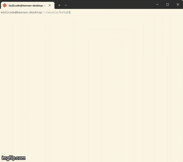

# kstah
Just a simple little app that I can use during streams for breaks and such.
Not a ton here yet. its an acronym for Keenan's Streaming Timer Ahhhhh. :)

## How to run
Npm install and then call node app.js with the total minutes you want
and the message as a string
``` javascript
node app.js 5 "message"
```

## Examples
Gif below is an example of calling the app from terminal.



## In Progress
- [x] Find node modules to use
- [x] Convert the input into total seconds
- [x] Add message param
- [x] Move the message around.
- [x] Convert show the input in countdown format with m:ss left
